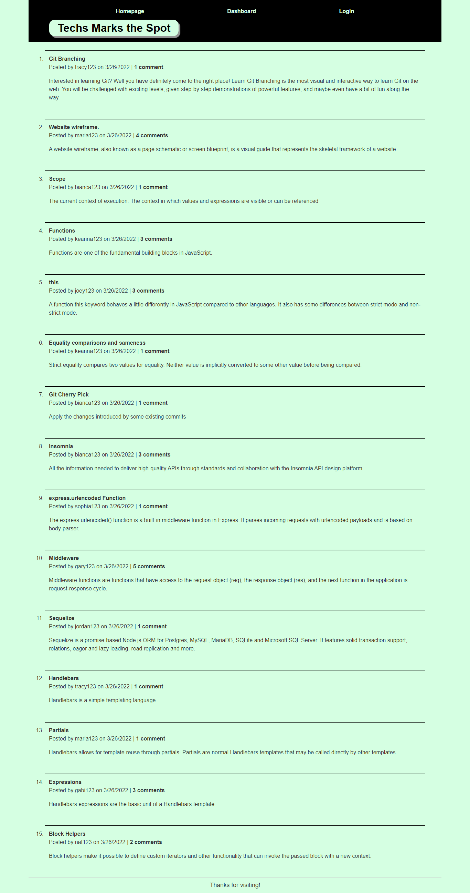
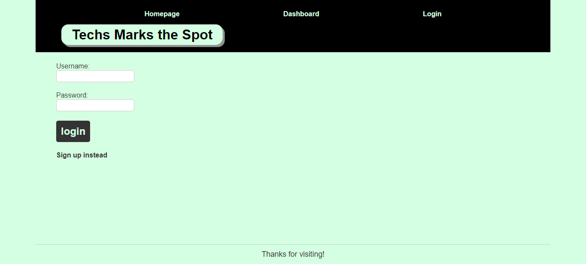
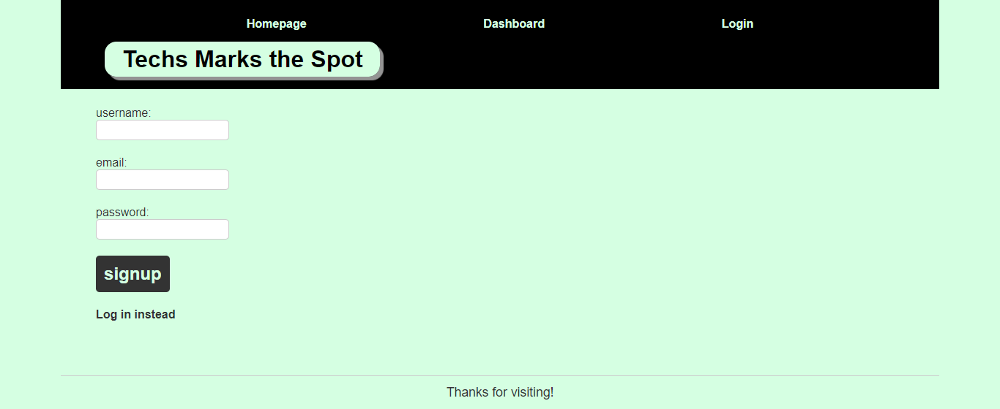
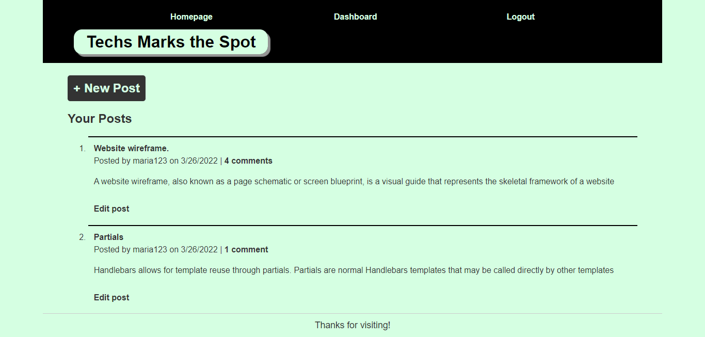
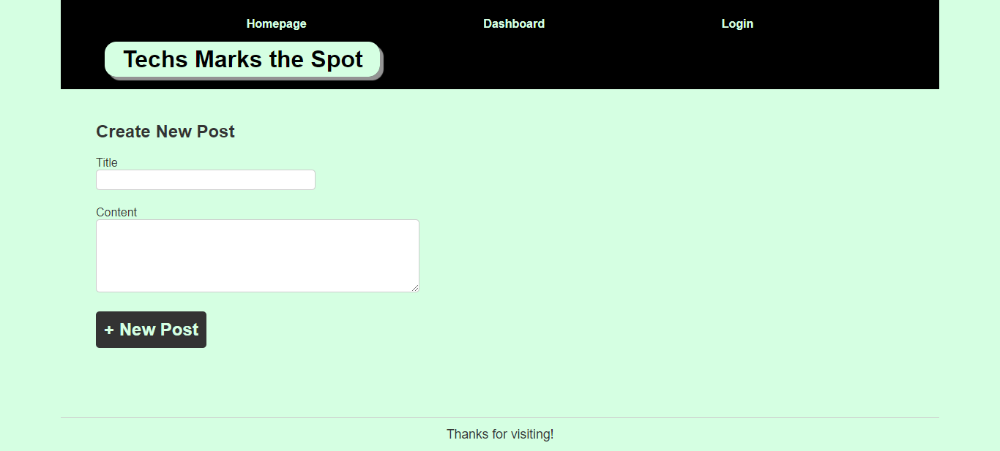
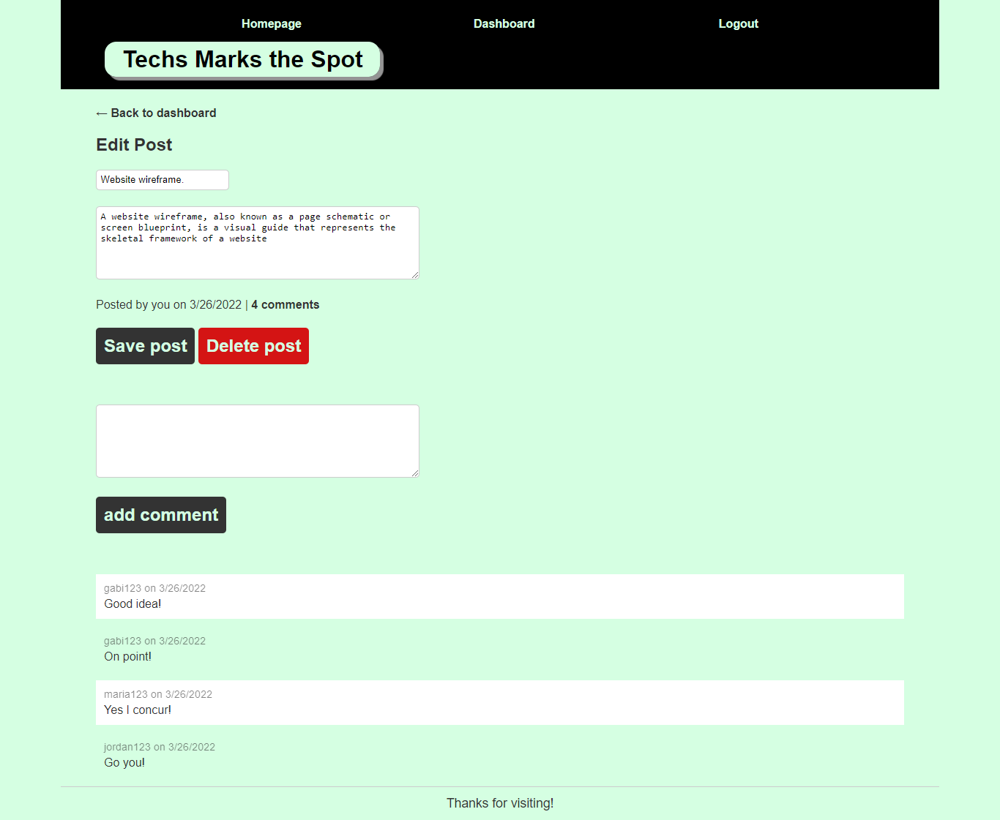

# Techs Marks the Spot

## Description
A webpage that allows users to create an acccount.  Then the user is able to view, create, update and delete posts.  The user is also allowed to comment on their or another users posts.

## Table of Contents
* [Link](#link)
* [Technologies](#technologies)
* [Installation](#installation)
* [Usage](#usage)
* [Images](#images)
* [Contributing](#contributing)
* [Questions](#questions)

## Link
Please see deployed link for application use: https://morning-reaches-56446.herokuapp.com/

## Technologies
* Express.js
* APIs
* Heroku
* HTML
* CSS
* JavaScript
* MySQL2
* Handlebars
* Sequelize
* Dotenv
* Bcrypt
* Express session

## Installation
* Please install packages using "npm i" 
* Please log into mysql and run the command "source db/schema.sql" to create database
* Run the command "npm run seed" to seed data to deployed application

## Usage
All dependencies must be install prior to using application. 

## Images

### Displays Homepage

 

### Displays Login

 

### Displays Sign Up

 

### Displays Dashboard

 

### Displays New Post

 

### Displays Edit Post

 

## Contributing
Pull requests are reviewed

## Questions
If you have any questions about opening an issue or the repository itself, please contact me at ajmarrocco@gmail.com.  Please visit https://github.com/ajmarrocco for more of my projects!